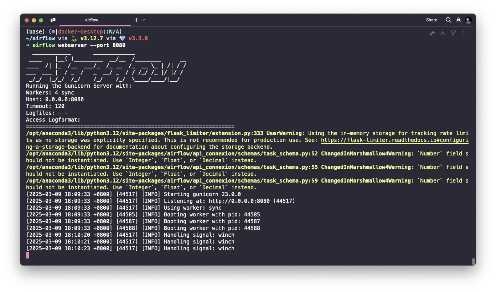
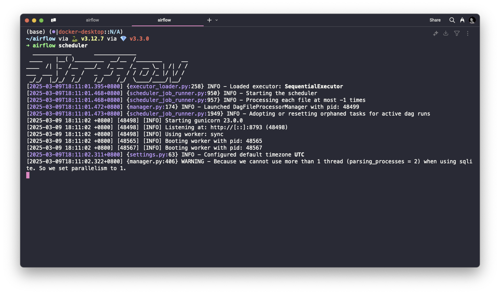
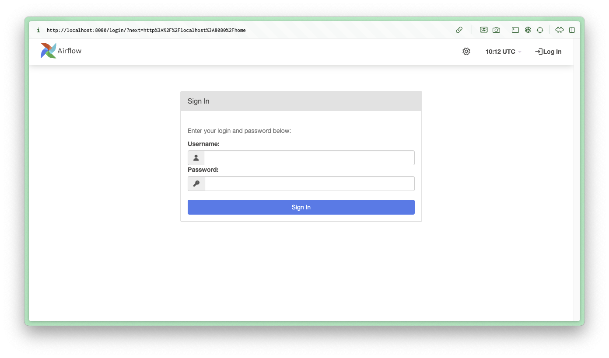
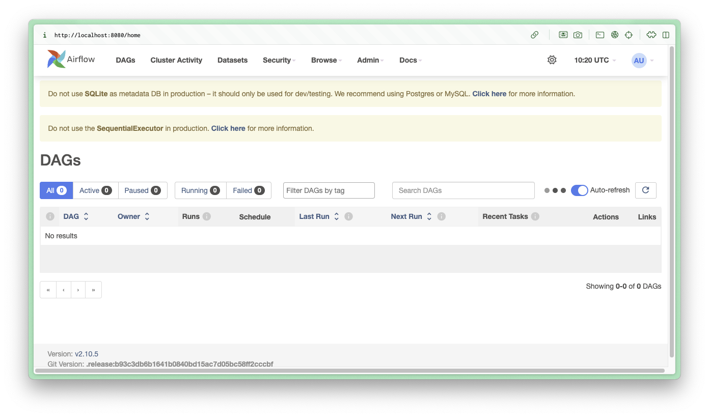

# Apache Airflow
Apache Airflow is a platform to programmatically author, schedule, and monitor workflows. It's essential for data engineering tasks and ETL processes.

## System Requirements
- Python 3.8+ installed
- 4GB RAM minimum (8GB+ recommended)
- 10GB free disk space
- POSIX-compliant operating system (Linux/macOS preferred, Windows via WSL2)

## Installation Options

### Additional setup for Windows users
Do ensure that you've set up WSL. After getting WSL Ubuntu installed, open it up and verify it comes with python 3.10 and above:
```sh
python3 -version
```
Assuming it still does, add these packages so that installing PIP will work:
```sh
sudo apt-get install software-properties-common
sudo apt-add-repository universe
sudo apt-get update
```
Install pip with:
```sh
sudo apt-get install python-pip (or python3-pip for Python 3)
```
Run the following 2 commands to install airflow:
```sh
export SLUGIFY_USES_TEXT_UNIDECODE=yes
pip install apache-airflow 
#(or pip3 for Python 3)
```

Open a new terminal and proceed with the steps below.

### Option 1: Using uv (Recommended for Development)
You can either use your Terminal (MacOS) or you can use Git Bash on WSL2 (Windows) -- use Visual Studio Code.
```sh
# Create a new directory for airflow
mkdir ~/airflow
cd ~/airflow

# Set the AIRFLOW_HOME environment variable
export AIRFLOW_HOME=$(pwd)

# Install airflow with minimal dependencies
pip install apache-airflow

# Initialize the database
airflow db init

# Create an admin user
airflow users create \
    --username admin \
    --firstname Admin \
    --lastname User \
    --role Admin \
    --email admin@example.com \
    --password admin
```

### Option 2: Using Docker (Recommended for Production)
1. Create a new directory:
```sh
mkdir airflow-docker
cd airflow-docker
```
2. Download the docker-compose file:
```sh
curl -LfO 'https://airflow.apache.org/docs/apache-airflow/stable/docker-compose.yaml'
```
3. Create required directories:
```sh
mkdir -p ./dags ./logs ./plugins ./config
```
4. Initialize environment:
```sh
docker-compose up airflow-init
```
5. Start services:
```sh
docker-compose up -d
```

## Initial Configuration

### Core Settings
1. Edit `airflow.cfg` in your AIRFLOW_HOME directory:
```cfg
[core]
# Don't load example DAGs
load_examples = False

# Set your timezone
default_timezone = UTC
```
2. Configure database (SQLite is default for development):
```cfg
[database]
sql_alchemy_conn = sqlite:///airflow.db
```
### Security Settings
1. Set secure configurations:
```cfg
[webserver]
# Enable authentication
authenticate = True

# Use secure connection
web_server_ssl_cert = /path/to/cert
web_server_ssl_key = /path/to/key

# Set session lifetime
session_lifetime_days = 1
```
## Starting Airflow Services
1. Local Development
```sh
airflow webserver --port 8080
```


2. In a new terminal, start the scheduler:
```sh
airflow scheduler
```


3. Access the UI at http://localhost:8080


4. Given that we have previously set the user to `admin` and the password to `admin`, use these credentials to sign in, and you should see the landing page as such.


## Docker Environment

Monitor services:
```sh
docker-compose ps
```

## Common Issues & Troubleshooting

### Installation Problems

1. Dependencies Conflict:
```sh
# Create a fresh virtual environment
python -m venv airflow_env
source airflow_env/bin/activate  # Linux/macOS
airflow_env\Scripts\activate     # Windows

# Install with constraints
pip install apache-airflow==2.7.1 --constraint constraints-3.8.txt
```

2. Database Issues:
```sh
# Reset the database
airflow db reset

# Upgrade the database
airflow db upgrade
```

3. Runtime Issues - DAGs Not Appearing:
- Check DAG file permissions
- Verify DAG directory path
- Check for Python syntax errors
- Review airflow logs

4. Runtime Issues - Scheduler Not Running:
```sh
# Check scheduler health
airflow scheduler -- --daemon

# View scheduler logs
tail -f logs/scheduler/latest
```

5. Worker Problems:
- Verify executor configuration
- Check resource availability
- Review worker logs

## Best Practice
### DAG Development
Structure:
```py
from airflow import DAG
from airflow.operators.python import PythonOperator
from datetime import datetime, timedelta

default_args = {
    'owner': 'airflow',
    'depends_on_past': False,
    'start_date': datetime(2024, 1, 1),
    'email_on_failure': False,
    'retries': 1,
    'retry_delay': timedelta(minutes=5),
}

with DAG('example_dag',
         default_args=default_args,
         schedule_interval='@daily') as dag:
    
    # Define tasks here
    pass
```

Testing:
- Use airflow tasks test for individual task testing
- Implement unit tests for custom operators
- Test DAGs in development environment first

### Production Deployment
Security:
- Use environment variables for sensitive data
- Implement role-based access control
- Regular security audits
Monitoring:
- Set up email notifications
- Monitor resource usage
- Regular log review
Scaling:
- Use CeleryExecutor for distributed tasks
- Configure proper resource pools
- Implement proper retry mechanisms

## Additional Resources
Documentation:
- [Official Documentation](https://airflow.apache.org/docs/)
- [Best Practices Guide](https://airflow.apache.org/docs/apache-airflow/stable/best-practices.html)

Community:
- [GitHub Issues](https://github.com/apache/airflow/issues)
- [Stack Overflow](https://stackoverflow.com/questions/tagged/airflow)
- [Slack Channel](https://apache-airflow.slack.com/)

Learning Resources:
- [Airflow Tutorials](https://airflow.apache.org/docs/apache-airflow/stable/tutorial.html)
- [Example DAGs](https://github.com/apache/airflow/tree/main/airflow/example_dags)