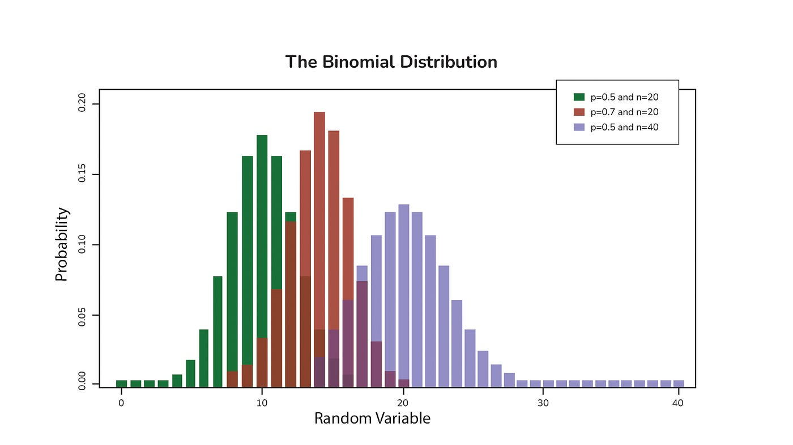
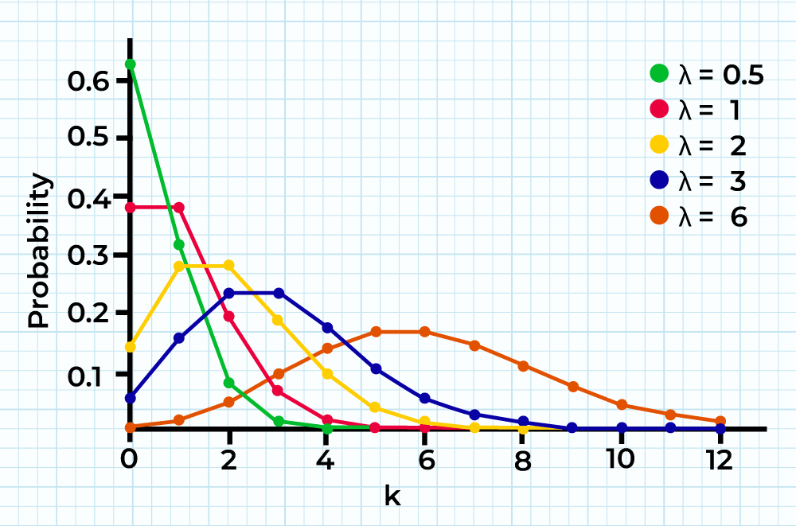
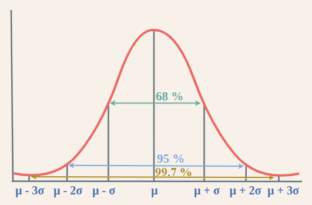
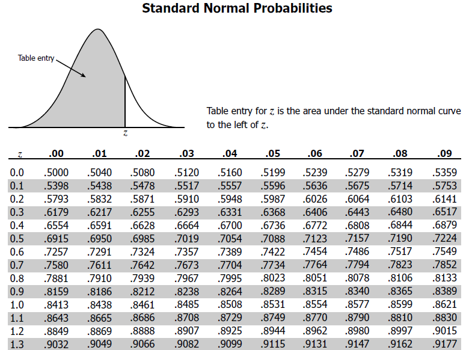

# Probability Distribution Families

A **probability distribution family** is a way to model a group of situations that show similar predictable patterns. Each distribution family has a specific set of conditions to model different types of situations.

- **Outcome of interest**: The specific outcome for which we calculate the probability, usually denoted by $k$.
- **Parameter**: A value that connects the probability distribution to a specific situation and determines how to adjust the distribution.

A **probability distribution function** is a formula that calculates the probability of an outcome based on the situation's parameters.

## Binomial Distribution

### Definition

The **binomial distribution** models the number of successes in a series of independent yes/no experiments (trials) with a constant probability of success.

- **Trial**: A single independent experiment with two possible outcomes (success/failure).
- **$n$**: Total number of trials.
- **$p$**: Probability of success in each trial.
- **$k$**: The number of successes we are interested in.

### Binomial Probability Formula

The probability of exactly $k$ successes in $n$ independent trials is given by:

$$
P(X = k) = \binom{n}{k} p^k (1 - p)^{n - k}
$$

where $\binom{n}{k}$ is the binomial coefficient:

$$
\binom{n}{k} = \frac{n!}{k!(n - k)!}
$$

### Mean and Variance of a Binomial Distribution

- **Mean (Expected Value)**:

  $$
  \mu = n \cdot p
  $$

- **Variance**:

  $$
  \sigma^2 = n \cdot p \cdot (1 - p)
  $$

## Poisson Distribution

### Definition

The **Poisson distribution** models the probability of a given number of events occurring in a fixed interval of time or space, assuming that these events happen at a known constant average rate and independently of the time since the last event.

- **$\lambda$**: The average rate of events in a given interval (also the mean of the distribution).

### Poisson Probability Formula

The probability of observing $k$ events in an interval is given by:

$$
P(X = k) = \frac{\lambda^k e^{-\lambda}}{k!}
$$

### Properties of the Poisson Distribution

- **Mean**:

$$
\mu = \lambda
$$

- **Variance**:

$$
\sigma^2 = \lambda
$$

### Conditions for Using Poisson Distribution

1. The random variable is discrete.
2. There is a known average success rate in a fixed interval.
3. The events are independent.
4. The occurrence of one event does not affect the probability of another event occurring.

## Normal Distribution

### Definition:

The **normal distribution** is a continuous probability distribution that is symmetrical and bell-shaped. It is often used to model real-world phenomena such as heights, weights, and test scores.

- **$\mu$**: Mean of the distribution.
- **$\sigma$**: Standard deviation, which determines the spread of the distribution.

### Probability Density Function (PDF) of Normal Distribution

The probability density function of a normal distribution is:

$$
f(x) = \frac{1}{\sigma \sqrt{2\pi}} e^{-\frac{(x - \mu)^2}{2\sigma^2}}
$$

### Properties of the Normal Distribution

- The curve is symmetric about the mean $\mu$.
- The total area under the curve is 1.
- The mean $\mu$ and standard deviation $\sigma$ define the shape of the distribution.

### Standard Normal Distribution

A **standard normal distribution** is a special case of the normal distribution with a mean of 0 and a standard deviation of 1. Values from any normal distribution can be converted to the standard normal distribution using the **Z-score**:

$$
Z = \frac{X - \mu}{\sigma}
$$

### The Empirical Rule (68-95-99.7 Rule)

- **68%** of data lies within 1 standard deviation of the mean.
- **95%** of data lies within 2 standard deviations of the mean.
- **99.7%** of data lies within 3 standard deviations of the mean.

## Z-Scores and Cumulative Probabilities

### Z-Score

A Z-score indicates how many standard deviations a specific value $X$ is from the mean:

$$
Z = \frac{X - \mu}{\sigma}
$$

### Z-Table

The **Z-table** provides cumulative probabilities for standard normal distributions. It helps in calculating the probability that a random variable will take a value less than or equal to $Z$.

## Central Limit Theorem (CLT)

The **Central Limit Theorem** states that the distribution of sample means from a population will tend to be normally distributed, regardless of the population’s original distribution, provided that the sample size is large enough.

### Application of CLT

This theorem is foundational for many statistical techniques, particularly in hypothesis testing and confidence intervals.
