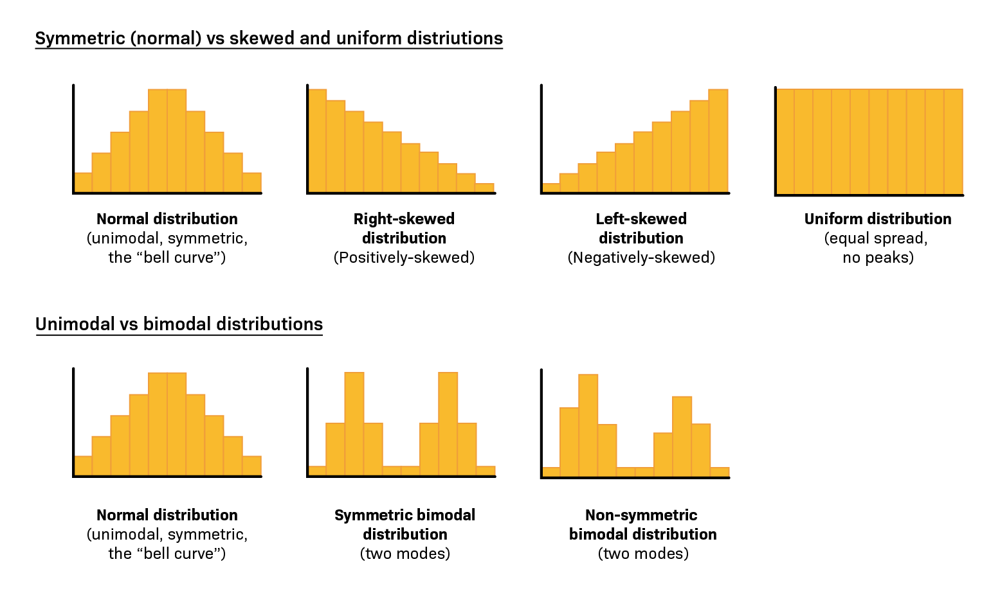

# Probability Distributions

## Random Variables

A **random variable** is a variable whose value is determined by the outcome of an experiment that involves chance. It is denoted by capital letters (e.g., $X$).

### Types of Random Variables

- **Discrete Random Variable**: If the number of possible values of a random variable is countable, it is discrete.
- **Continuous Random Variable**: If the number of possible values of a random variable is uncountable, it is continuous.
- **Infinite Random Variable**: The possible values of a random variable do not exist on a closed range.
- **Finite Random Variable**: The possible values of a random variable can be counted within a closed range.

## Probability Distributions

A **probability distribution** represents the probabilities of all possible outcomes of a random variable. It can be expressed as graphs, equations, or tables.

### Notation

- $P(X = x)$: The probability that the random variable $X$ takes the specific value $x$.

### Types of Probability Distributions

- **Discrete Probability Distribution**: A countable set of probabilities associated with the possible outcomes of a discrete random variable. In graph form, it is often represented as a bar graph.
- **Continuous Probability Distribution**: An uncountable set of probabilities associated with the possible outcomes of a continuous random variable. In graph form, it is often represented as a smooth curve.

#### Important Properties

- For a discrete probability distribution, the sum of all probabilities is 1:

  $$
  \sum P(X = x) = 1
  $$

- For a continuous probability distribution, the area under the curve is 1:

  $$
  \int_{-\infty}^{\infty} f(x) dx = 1
  $$

### Weighted Average

For discrete distributions, the **mean** is the weighted average of all the possible outcomes multiplied by their probabilities:

$$
\mu = \sum x_i P(X = x_i)
$$

## Expected Value and Variance

### Expected Value $E(X)$

The expected value is the **mean** of a probability distribution, calculated as a weighted average:

$$
E(X) = \sum x_i P(X = x_i)
$$

For a linear transformation:

$$
E(cX) = cE(X), \quad E(X + Y) = E(X) + E(Y)
$$

### Linearity of Expectation

For any two random variables $X$ and $Y$:

$$
E(X + Y) = E(X) + E(Y)
$$

This holds regardless of whether $X$ and $Y$ are dependent or independent.

### Variance $\text{Var}(X)$

The variance is a measure of how spread out the distribution is from its mean:

$$
\text{Var}(X) = E\left[(X - \mu)^2\right] = \sum (x_i - \mu)^2 P(X = x_i)
$$

The **standard deviation** is the square root of the variance:

$$
\sigma = \sqrt{\text{Var}(X)}
$$

## Shapes of Distributions

### Skewness

- **Positive Skew**: The distribution has a long tail on the right side.
- **Negative Skew**: The distribution has a long tail on the left side.

### Modes

- **Unimodal**: A distribution with one peak.
- **Bimodal**: A distribution with two peaks.
- **Multimodal**: A distribution with more than two peaks.

