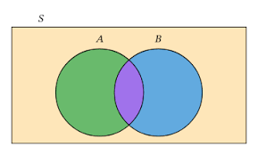

# Probability Fundamentals

## Introduction to Probability

**Experiment**: A situation involving chance, like rolling a six-sided die.

- **Outcome**: The possible result of an experiment (e.g., rolling a 3).
- **Sample Space**: All possible outcomes of an experiment, written as a set (e.g., \( S = \{1, 2, 3, 4, 5, 6\} \)).
- **Event**: A collection of possible outcomes within the sample space (e.g., rolling an even number: \( E = \{2, 4, 6\} \)).

**Probability**: The likelihood of something happening. It is calculated by the formula:
\[
P(E) = \frac{\text{\# of elements in event } E}{\text{\# of elements in sample space } S}
\]
For example, the probability of rolling an even number from a six-sided die is:
\[
P(E) = \frac{3}{6} = 0.5
\]

### Types of Probability

- **Theoretical Probability**: Calculated based on knowledge of a situation (e.g., the outcome of a coin flip).
- **Experimental Probability**: Derived from repeated trials of experiments, calculated by:
  \[
  \text{Experimental Probability} = \frac{\text{\# of times desired outcome occurred}}{\text{total \# of trials}}
  \]
- **Subjective Probability**: Based on intuition or personal judgment.

**Note**: Theoretical probabilities are the most reliable, followed by experimental probabilities, with subjective probabilities being the least reliable.

## Symbols, Rules, and Laws

### Venn Diagrams

- **Venn Diagrams**: Show logical relationships between events, helping us understand probabilities.

- **Sample Space**: Represented by a box.
- **Events**: Represented by circles within the box.
- **Complement of an Event**: Represented by the area outside the circle (denoted as \( A^C \)).
- **Intersection of Events**: Overlap of two circles, denoted as \( A \cap B \).
- **Union of Events**: Everything within the circles, denoted as \( A \cup B \).

### Basic Probability Rules

1. Probabilities cannot be negative.
2. The total probability of all possible outcomes is 1 (or 100%).
3. The probability of an event either happening or not happening is 1 (100%).

## Probability Rules

### The Addition Rule

- **Addition Rule for Disjoint Events**: For events that cannot happen simultaneously (mutually exclusive), the probability is:
  \[
  P(A \cup B) = P(A) + P(B)
  \]
- **General Addition Rule**: For events that can happen simultaneously:
  \[
  P(A \cup B) = P(A) + P(B) - P(A \cap B)
  \]

### The Multiplication Rule

- **Multiplication Rule for Independent Events**: If two events are independent (one does not affect the other), the probability of both happening is:
  \[
  P(A \cap B) = P(A) \times P(B)
  \]
- **General Multiplication Rule**: For dependent events (where one event affects the other), the probability is:
  \[
  P(A \cap B) = P(A|B) \times P(B)
  \]
  Where \( P(A|B) \) is the conditional probability of \( A \) given \( B \).

### Conditional Probability

- **Conditional Probability**: The probability of an event \( A \) occurring given that \( B \) has occurred, written as \( P(A|B) \):
  \[
  P(A|B) = \frac{P(A \cap B)}{P(B)}
  \]

## Bayes' Rule and the Law of Total Probability

### Bayes' Rule

- **Bayes' Rule**: Used to update a probability based on new information:
  \[
  P(A|B) = \frac{P(B|A) \times P(A)}{P(B)}
  \]

### Law of Total Probability (LTP)

- **Law of Total Probability**: The probability of an event can be derived by splitting the sample space into partitions and summing the probabilities of each partition:
  \[
  P(A) = P(A \cap B) + P(A \cap B^C)
  \]
  This rule is useful for scenarios like medical testing, where the false positive rate is known.

## Important Concepts

- **Independent Events**: Events where the occurrence of one does not influence the other (e.g., flipping a coin twice).
- **Disjoint Events**: Events that cannot occur simultaneously (e.g., flipping heads and tails on the same coin flip).
- **Marginal Probability**: The probability of a single event occurring.
- **Joint Probability**: The probability of two events occurring together.
