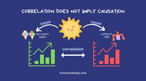

# Two-Variable Statistics

## Correlation and Causation

### Correlation

A **correlation** refers to a relationship between two variables where one can predict the other. There are two types of correlations:

1. **Positive correlation**: As variable $A$ increases, variable $B$ also increases.
2. **Negative correlation**: As variable $A$ increases, variable $B$ decreases (and vice versa).

**Important Note**:  
Correlation does not imply causation, meaning that just because two variables are correlated, one does not necessarily cause the other. However, if causation is proven, correlation must exist.

$$
\text{Correlation} \neq \text{Causation}
$$

$$
\text{Causation} \implies \text{Correlation}
$$

{width=400}

### Causation

**Causation** occurs when one event directly causes another. In experiments, causation can be determined by carefully controlling variables.

- **Experiment**: A study where researchers manipulate variables to observe effects.
- **Control group**: The group that does not receive the treatment.
- **Treatment group**: The group that receives the treatment.
- **Blind experiment**: Subjects do not know which treatment they receive (control or experimental).
- **Double-blind experiment**: Neither subjects nor researchers know which treatment each subject receives.
- **Confounding variables**: External factors that may affect the outcome of an experiment.

### Variables in Experiments

- **Independent variable**: The variable manipulated by the researcher.
- **Dependent variable**: The variable measured in response to changes in the independent variable.

### The Placebo Effect

The **placebo effect** is a confounding variable where the subject's reaction is influenced simply by the act of being treated or tested, not by the treatment itself.

## Observational Studies

### Types of Studies

1. **Observational study**: Researchers collect data without influencing the variables. These studies demonstrate correlation but do not prove causation.
2. **Retrospective study**: Researchers look backward to examine past outcomes.
3. **Prospective study**: Researchers look forward to future outcomes.
4. **Blocking**: Dividing subjects based on confounding variables, ensuring both control and treatment groups are balanced.

## Scatter Plots

A **scatter plot** is a graphical representation that shows the relationship between two quantitative variables.

### Relationships in Scatter Plots

1. **Linear relationship**: The points on the scatter plot form a line.
2. **Positive correlation (direct relationship)**: As $x$ increases, $y$ also increases.
3. **Negative correlation (inverse relationship)**: As $x$ increases, $y$ decreases.
4. **Zero correlation**: No discernible relationship between $x$ and $y$.

### Correlation Coefficient

The **correlation coefficient** ($r$) measures the strength and direction of the linear relationship between two variables. The value of $r$ ranges from -1 to 1.

$$
-1 \leq r \leq 1
$$

- $r = 1$: Perfect positive correlation
- $r = -1$: Perfect negative correlation
- $r = 0$: No correlation

A negative $r$ indicates an inverse relationship, while a positive $r$ indicates a direct relationship. Values close to zero suggest weak or no correlation.

$$
\text{For strong positive correlation, } r \approx 1
$$

$$
\text{For strong negative correlation, } r \approx -1
$$

### Covariance

**Covariance** measures how two variables change together. Positive covariance means that as one variable increases, the other tends to increase as well. Negative covariance implies that as one variable increases, the other decreases.

$$
\text{Cov}(X, Y) = \frac{\sum{(X_i - \overline{X})(Y_i - \overline{Y})}}{n}
$$

Where:

- $X_i$ and $Y_i$ are the individual data points,
- $\overline{X}$ and $\overline{Y}$ are the means of $X$ and $Y$, and
- $n$ is the number of data points.

The formula for the correlation coefficient $r$ is:

$$
r = \frac{\text{Cov}(X, Y)}{\sigma_X \sigma_Y}
$$

Where:

- $\text{Cov}(X, Y)$ is the **covariance** of the two variables $X$ and $Y$,
- $\sigma_X$ is the **standard deviation** of variable $X$,
- $\sigma_Y$ is the **standard deviation** of variable $Y$.
