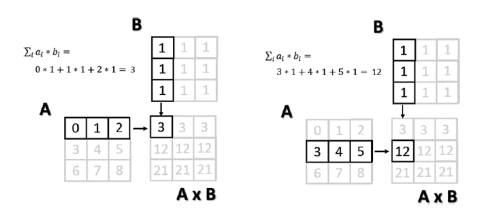

# Linear Algebra

## Unique and Other Set Logic

You can use `unique` to return a sorted array of unique values.

```python
names = np.array(["Bob", "Will", "Joe", "Bob", "Will", "Joe", "Joe"])
np.unique(names)
```

```python
np.unique(np.array([3, 3, 3, 2, 2, 1, 1, 4, 4]))
```

`in1d` tests membership of the values in one array in another, returning a boolean array.

```python
np.in1d([2, 3, 6], [1, 2, 3, 4, 5])
```

Refer to the [official documentation](https://numpy.org/doc/stable/reference/routines.set.html) for more set operations.

> Search for a set function that finds the common values between two arrays.
> Run it on `x` and `y` arrays below.

```python
x = np.array([1, 2, 3, 4, 5])
y = np.array([3, 4, 5, 6, 7])
```

## Linear Algebra

Linear algebra operations, like matrix multiplication, decompositions, determinants, and other square matrix math, are an important part of many array libraries.

Multiplying two two-dimensional arrays with `*` is an element-wise product, while matrix multiplications require either using the `dot` function or the `@` infix operator.



```python
x = np.array([[1, 2, 3], [4, 5, 6]])
y = np.array([[6, 23], [-1, 7], [8, 9]])

x.dot(y)
```

You can also use the `@` operator:

```python
x @ y
```

Or the `dot` function:

```python
np.dot(x, y)
```

Refer to the [official documentation](https://numpy.org/doc/stable/reference/routines.linalg.html) for more linear algebra operations.

```python
a = np.array([[1, 2], [3, 4]])
```
