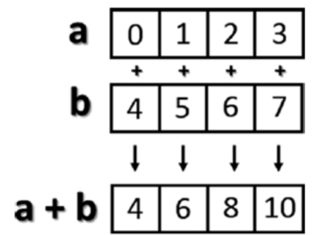
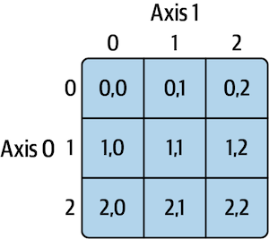

# ndarray Basic

## Arithmetic with ndarrays

Arithmetic operations are applied as batch operations on arrays without any `for` loops. This is called _vectorization_. Any arithmetic operations between equal-size arrays applies the operation element-wise.



```python
arr = np.array([[1.0, 2.0, 3.0], [4.0, 5.0, 6.0]])
arr
```

```python
arr * arr
```

```python
arr - arr
```

Broadcasting is another powerful feature of Numpy. It describes how arithmetic works between arrays of different shapes. For example, you can think of the smaller array (or scalar value) being replicated multiple times to match the shape of the larger array.

```python
arr + np.array([1, 1, 1])
```

Here, `[1, 1, 1]` is stretched or broadcasted across the larger array `arr` so that it matches the shape.

```python
arr1 = np.array([1, 2, 3, 4])
```

```python
arr1 + 4
```

4 becomes `[4, 4, 4, 4]` beneath the hood, then arithmetic happens element-wise.

```python
arr1**2
```

```python
1 / arr1
```

To find out more about broadcasting, check out the [official documentation](https://numpy.org/doc/stable/user/basics.broadcasting.html).

Comparison between arrays of the same size yields boolean arrays.

```python
arr2 = np.array([[0.0, 4.0, 1.0], [7.0, 2.0, 12.0]])
arr2
```

```python
arr2 > arr
```

## Indexing and Slicing

Indexing and slicing allow you to select subsets of array data.

One-dimensional arrays are simple; on the surface, they act similarly to Python lists.

```python
arr = np.arange(10)
arr
```

Indexing to select a single element.

```python
arr[5]
```

Slicing to select a range of elements.

```python
arr[5:8]
```

You can also assign a value to it, which will be propagated to the entire selection.

```python
arr[5:8] = 12
arr
```

Array slices are views on the original array. This means that the data is not copied, and any modifications to the view will be reflected in the source array (in-place).

```python
arr_slice = arr[5:8]
arr_slice
```

```python
arr_slice[1] = 10
arr
```

The "bare" slice `[:]` will assign to all values in an array.

```python
arr_slice[:] = 64
arr
```

In a two-dimensional array, the elements at each index are no longer scalars but rather one-dimensional arrays.

```python
arr2d = np.array([[1, 2, 3], [4, 5, 6], [7, 8, 9]])
arr2d[1]
```

You can index it "twice" to get individual elements. These two expressions are equivalent.

```python
arr2d[1][2]
```

```python
arr2d[1, 2]
```

For 2D array indexing, the syntax is `arr2d[row_index, col_index]` or `arr2d[axis_0_index, axis_1_index]`. Think of axis 0 as the "rows" of the array and axis 1 as the "columns."



To slice out the first two rows of the `arr2d` array, you can pass `[:2]` as the row index.

```python
arr2d[:2]
```

You can pass multiple slices just like you can pass multiple indexes:

```python
arr2d[:2, 1:]
```

You can mix indexing and slicing.

```python
arr2d[1, :2]
```

Passing a slice with `:` means to select the entire axis. To select the first column:

```python
arr2d[:, :1]  # or arr2d[:, 0]
```

Check the shape:

```python
arr2d[:, :1].shape
```

To select the first row:

```python
arr2d[:1, :]  # or arr2d[0, :]
```

Check the shape:

```python
arr2d[:1, :].shape
```
