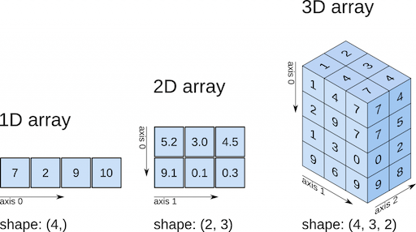

# Numpy ndarray

## Introduction

Numpy's `ndarray`, or N-dimensional array, is a fast, flexible container for large datasets in Python. Arrays enable you to perform mathematical operations on whole blocks of data using similar syntax to the equivalent operations between scalar elements.

```python
data = np.array([1.5, -0.1, 3])
```

Multiply all of the elements by 10.

```python
data * 10
```

Add the corresponding values in each "cell" in the array.

```python
data + data
```

## Illustration

An ndarray is a multidimensional or n-dimensional array of fixed size with homogenous elements (i.e., all elements must be of the same type). Every array has a `shape`, a tuple indicating the size of each dimension, and a `dtype`, an object describing the data type of the array.



```python
data.shape
```

```python
data.dtype
```

The easiest way to create an array is to use the `array` function.

```python
data1 = [6, 7.5, 8, 0, 1]
arr1 = np.array(data1)
arr1
```

Nested sequences, like a list of equal-length lists, will be converted into a multidimensional array.

```python
data2 = [[1, 2, 3, 4], [5, 6, 7, 8]]
arr2 = np.array(data2)
arr2
```

```python
arr2.dtype
```

```python
arr2.shape
```

We can also check the number of dimensions.

```python
arr2.ndim
```

Besides `array`, there are other functions for creating new arrays. We have seen `arange` above, which is similar to the built-in `range` function but returns an array instead of a list.

`ones` and `zeros` create arrays of 1s and 0s, respectively, with a given length or shape. `empty` creates an array without initializing its values to any particular value. To create a higher dimensional array with these methods, pass a tuple for the shape.

```python
np.zeros(5)
```

```python
np.zeros((3, 6))
```

You can also explicitly specify the data type of the array.

```python
arr1 = np.array([1, 2, 3], dtype=np.float64)
arr1.dtype
```

```python
arr2 = np.array([1, 2, 3], dtype=np.int32)
arr2.dtype
```

## Data types

Data types provide a mapping directly onto an underlying disk or memory representation. The numerical data types are named the same way: a type name, like `float` or `int`, followed by a number indicating the number of bits per element. A standard double-precision floating point value (what's used under the hood in Python's `float` object) takes up 8 bytes or 64 bits. Thus, this type is known in Numpy as `float64`. See the following table for a list of the numerical data types.

| Data type                         | Type code    | Description                                                                                                            |
| --------------------------------- | ------------ | ---------------------------------------------------------------------------------------------------------------------- |
| int8, uint8                       | i1, u1       | Signed and unsigned 8-bit (1 byte) integer types                                                                       |
| int16, uint16                     | i2, u2       | Signed and unsigned 16-bit integer types                                                                               |
| int32, uint32                     | i4, u4       | Signed and unsigned 32-bit integer types                                                                               |
| int64, uint64                     | i8, u8       | Signed and unsigned 64-bit integer types                                                                               |
| float16                           | f2           | Half-precision floating point                                                                                          |
| float32                           | f4 or f      | Standard single-precision floating point. Compatible with C float                                                      |
| float64                           | f8 or d      | Standard double-precision floating point. Compatible with C double and Python float object                             |
| float128                          | f16 or g     | Extended-precision floating point                                                                                      |
| complex64, complex128, complex256 | c8, c16, c32 | Complex numbers represented by two 32, 64, or 128 floats, respectively                                                 |
| bool                              | ?            | Boolean type storing True and False values                                                                             |
| object                            | O            | Python object type                                                                                                     |
| string\_                          | S            | Fixed-length ASCII string type (1 byte per character). For example, to create a string dtype with length 10, use 'S10' |
| unicode\_                         | U            | Fixed-length Unicode type (number of bytes platform specific). Same specification semantics as string\_ (e.g., 'U10')  |

You can explicitly convert or cast an array from one dtype to another using the `astype` method.

```python
arr = np.array([1, 2, 3, 4, 5])
arr.dtype
```

```python
float_arr = arr.astype(np.float64)
float_arr
```

```python
float_arr.dtype
```

If you cast some floating-point numbers to be of integer dtype, the decimal part will be truncated.

```python
arr = np.array([3.7, -1.2, -2.6, 0.5, 12.9, 10.1])
arr.astype(np.int32)
```

You can also convert strings representing numbers to numeric form.

```python
numeric_strings = np.array(["1.25", "-9.6", "42"], dtype=np.string_)
numeric_strings.astype(float)
```

If you write `float` instead of `np.float64`, Numpy will guess the data type for you.
