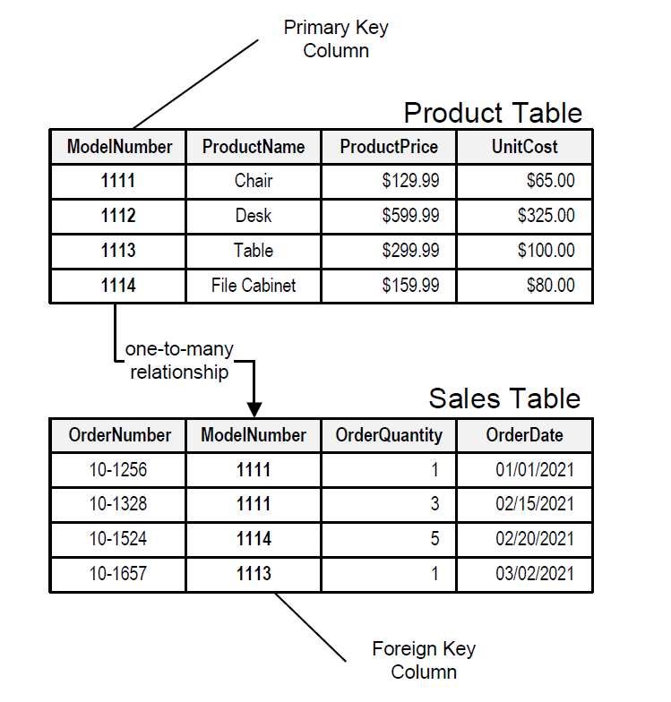

# Data Querying with SQL

## Overview

This lesson introduces SQL (Structured Query Language) for querying data from relational databases. You will learn how to retrieve, filter, and manipulate data using SQL queries. This is a fundamental skill for anyone working with data, enabling efficient access and analysis of information stored in relational database management systems (RDBMS).

## Relational Databases

Relational databases organize data into tables with rows (records) and columns (attributes). Each table represents a specific entity (e.g., customers, products, orders), and relationships between tables are established through shared columns (keys). The relational model ensures data integrity and efficiency in querying and managing large datasets. Key concepts include:

- **Tables:** Organized collections of data.
- **Rows (Records):** Individual entries within a table.
- **Columns (Attributes):** Specific data points within each row.
- **Primary Key:** Uniquely identifies each row in a table.
- **Foreign Key:** Establishes relationships between tables by referencing primary keys in other tables.
- **Relationships:** Define how data in different tables are connected (one-to-one, one-to-many, many-to-many).

## SQL (Structured Query Language)

SQL is the standard language for interacting with relational databases. It allows you to perform various operations, including:

- **Data Retrieval (SELECT):** Extracting specific data from one or more tables. This involves specifying the columns to retrieve and applying filtering conditions (WHERE clause).
- **Data Manipulation (INSERT, UPDATE, DELETE):** Adding new data, modifying existing data, and removing data from tables.
- **Data Definition (CREATE, ALTER, DROP):** Creating new tables, modifying table structures, and deleting tables.
- **Data Control (GRANT, REVOKE):** Managing user access and permissions to database objects.

## Chapter Outline

This chapter will cover the following topics in more detail:

1. Introduction to Relational Databases and SQL: A deeper dive into relational databases, data types and database connection.
2. Introduction to SQL and Basic Queries: Basic SQL syntax, SELECT statements, and filtering data with WHERE clause.
3. Advanced Filtering and Sorting: Data filtering techniques and result ordering to get precisely the data you need.
4. Multiple Table Operations: Understand how to work with multiple tables using different types of JOINs or UNION.
5. Data Aggregation and Grouping: Learn to summarize data and perform calculations across groups of records.
