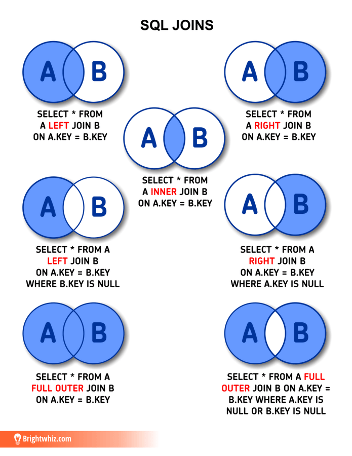

# Multiple Table Operations

In real-world databases, data is typically distributed across multiple tables to maintain organization and reduce redundancy. Understanding how to combine these tables is crucial for data analysis.

## Understanding Table Relationships

The Chinook database contains several related tables:

- `Artists` and `Albums`: One artist can have many albums
- `Albums` and `Tracks`: One album can have many tracks
- `Customers` and `Invoices`: One customer can have many invoices



## INNER JOIN

INNER JOIN returns only the matching records between two tables.

```sql
-- Get all tracks with their album names
SELECT Tracks.Name AS TrackName,
       Albums.Title AS AlbumTitle
FROM Tracks
INNER JOIN Albums ON Tracks.AlbumId = Albums.AlbumId;
```

## LEFT JOIN

LEFT JOIN returns all records from the left table and matching records from the right table.

```sql
-- Get all artists and their albums (including artists with no albums)
SELECT Artists.Name AS ArtistName,
       Albums.Title AS AlbumTitle
FROM Artists
LEFT JOIN Albums ON Artists.ArtistId = Albums.ArtistId;
```

## RIGHT JOIN

SQLite doesn't support RIGHT JOIN directly, but you can achieve the same result by reversing the table order in a LEFT JOIN.

```sql
-- Equivalent to RIGHT JOIN (showing all albums and their artists)
SELECT Artists.Name AS ArtistName,
       Albums.Title AS AlbumTitle
FROM Albums
LEFT JOIN Artists ON Albums.ArtistId = Artists.ArtistId;
```

## UNION

UNION combines the results of two or more SELECT statements and removes duplicates. UNION ALL keeps duplicates.

```sql
-- Combine rock and jazz tracks
SELECT Tracks.Name AS TrackName,
       Genres.Name AS GenreName
FROM Tracks
JOIN Genres ON Tracks.GenreId = Genres.GenreId
WHERE Genres.Name = 'Rock'
UNION
SELECT Tracks.Name AS TrackName,
       Genres.Name AS GenreName
FROM Tracks
JOIN Genres ON Tracks.GenreId = Genres.GenreId
WHERE Genres.Name = 'Jazz';

-- Find total sales by both country and city
SELECT BillingCountry AS Location,
       SUM(Total) AS TotalSales
FROM Invoices
GROUP BY BillingCountry
UNION ALL
SELECT BillingCity,
       SUM(Total)
FROM Invoices
GROUP BY BillingCity;
```

## Self Joins

Self joins are used when you need to join a table to itself. For example, if the Employee table has a ReportsTo field:

```sql
-- Find employees and their managers
SELECT e1.FirstName || ' ' || e1.LastName AS Employee,
       e2.FirstName || ' ' || e2.LastName AS Manager
FROM Employees e1
LEFT JOIN Employees e2 ON e1.ReportsTo = e2.EmployeeId;
```

## Using Aliases

Table aliases make queries more readable, especially with multiple joins:

```sql
-- Complex query using aliases
SELECT c.FirstName || ' ' || c.LastName AS CustomerName,
    i.InvoiceDate,
    t.Name AS TrackName,
    a.Title AS AlbumTitle,
    g.Name AS GenreName
FROM Customers c
JOIN Invoices i ON c.CustomerId = i.CustomerId
JOIN Tracks t ON t.TrackId = t.TrackId
JOIN Albums a ON t.AlbumId = a.AlbumId
JOIN Genres g ON t.GenreId = g.GenreId;
```
