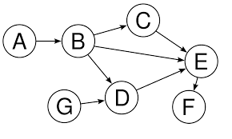
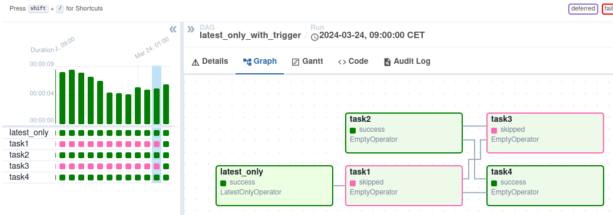
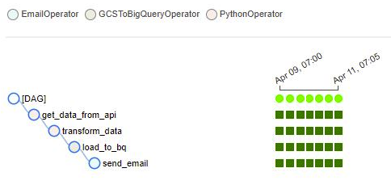
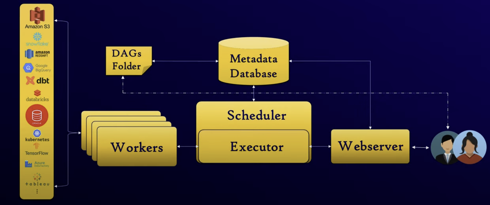

# What is Apache Airflow?

Apache Airflow is an open-source platform designed to programmatically author, schedule, and monitor workflows. It allows you to define complex data pipelines as code, making them easier to maintain, version, test, and collaborate on.

From Wikipedia:
> [Airflow](https://airflow.apache.org/) started at Airbnb in October 2014 as a solution to manage the company's increasingly complex workflows. Creating Airflow allowed Airbnb to programmatically author and schedule their workflows and monitor them via the built-in Airflow UI. From the beginning, the project was made open source, becoming an Apache Incubator project in March 2016 and a top-level [Apache Software Foundation](https://en.wikipedia.org/wiki/The_Apache_Software_Foundation) project in January 2019.

> Airflow is written in Python and workflows are created via Python scripts. Airflow is designed under the principle of "configuration as code". While other "configuration as code" workflow platforms exist using markup languages like XML using Python allows developers to import libraries and classes to help them create their workflows.

## Key Concepts

1. DAG (Directed Acyclic Graph)



- The core concept in Airflow
- Represents your workflow as a collection of tasks with dependencies
- "Directed" because tasks have direction (task A → task B)
- "Acyclic" because you cannot create cycles (no task can depend on itself)

2. Tasks



- Individual units of work in your workflow
- Usually implemented as Operators, Sensors, or TaskFlow decorated functions

3. Operators


- Predefined templates for common tasks:

a. `BashOperator`: Executes a bash command

b. `PythonOperator`: Calls a Python function

c. `EmailOperator`: Sends an email

d. Many more built-in and custom operators


4. Scheduling



- Each DAG has a schedule interval (daily, hourly, etc.)
- Defined using cron expressions or preset intervals

## Basic Example
Here's what a simple DAG looks like in Python:
```py
from datetime import datetime, timedelta 
from airflow import DAG 
from airflow.operators.bash import BashOperator  

default_args = {
     'owner': 'airflow',
     'depends_on_past': False,
     'email_on_failure': False,     
     'email_on_retry': False,     
     'retries': 1,     
     'retry_delay': timedelta(minutes=5), 
}  

with DAG(     
			'hello_world',
			default_args=default_args,
			description='A simple hello world DAG',
			schedule_interval=timedelta(days=1),
			start_date=datetime(2025, 3, 10),
			catchup=False, 
) as dag:          

			# Define tasks     
			t1 = BashOperator(         
						task_id='print_date',         
						bash_command='date',     
			)          
			
			t2 = BashOperator(         
						task_id='print_hello',
						bash_command='echo "Hello World!"',     
			)          
			
			# Set task dependencies     
			t1 >> t2   # t1 runs before t2
```

## Airflow Components



1. Web Server: UI that visualizes DAGs and allows interaction
2. Scheduler: Triggers task execution according to dependencies and schedule
3. Workers: Execute the actual tasks
4. Metadata Database: Stores state information

## Getting Started

See also: 
1. Installation: `pip install apache-airflow`
2. Initialize: `airflow db init`
3. Create a user: `airflow users create`
4. Start the web server: `airflow webserver`
5. Start the scheduler: `airflow scheduler`
6. Access UI: Navigate to http://localhost:8080

## Common Use Cases

1. ETL (Extract, Transform, Load) processes
2. Data pipeline orchestration
3. Machine learning workflows
4. Regular data quality checks
5. Report generation and distribution

Airflow is particularly powerful for complex workflows with multiple steps and dependencies, especially when reliability and monitoring are important.