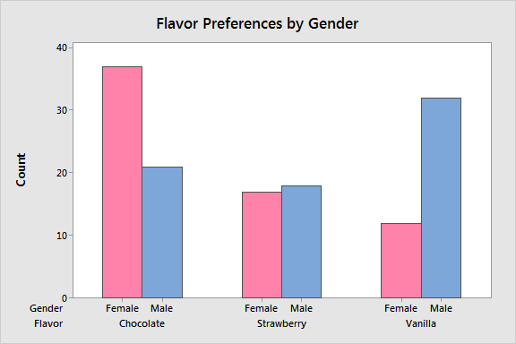
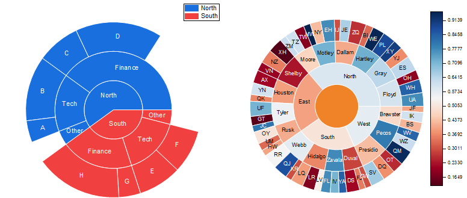

# Overview

Data visualization is where art meets analytics - it's the craft of transforming raw data into compelling visual stories. Think of it as translating numbers into pictures that anyone can understand, making complex data accessible and actionable.

## Why Data Visualization?

Text and numbers only -> 10% retention

With Visuals -> 65% retention

### Key Benefits
1. Quick Pattern Recognition
- Spot trends instantly
- Identify outliers
- Discover relationships
2. Better Communication
- Bridge technical gaps between data specialists and decision-makers
- Enhance presentations from information delivery to more compelling storytelling
- Support data-driven decisions with clear, actionable visuals
3. Deeper Insights
- Uncover hidden patterns and correlations within complex datasets
- Compare multiple scenarios to evaluate potential outcomes
- Test hypotheses visually before applying advanced statistical methods

## Core Principles

### Chart Selection Guide
- Comparison between Items:
If there are few items, use a Bar Chart:



If there are many items, use a Lollipop Chart:


- Over time: Line Chart


- Single Variable Distribution: Histogram


- Distribution by Multiple Groups: Box Plot


- Distribution Density: Violin Plot


- Two Variable Relationship: Scatter Plot


- Three Variable Relationships: Bubble Chart


- Many Variable Relationships: Parallel Coordinates


- Static Composition: Tree Map (or Pie Chart)


- Composition Over Time: Stacked Area / Stream Graph


- Hierarchical Composition: Sunburst Diagram (or Tree Map)



### Visual Hierarchy


Importance level:
- **Primary** - Key message (largest, boldest, high contrast)
- <u>Secondary</u> - Supporting data (medium emphasis)
- *Tertiary* - Context, details (smallest, lowest contrast)

### Data-Ink Ratio (Tufte's Principle)

Edward Tufte introduced the concept of the **data-ink ratio** in his 1983 book "The Visual Display of Quantitative Information." We attempt to maximise the data-ink ratio by eliminating non-essential visual elements.


In the example above, the top chart uses excessive ink on grid lines, backgrounds, borders, and redundant elements while the bottom chart focuses almost exclusively on the data itself, using ink primarily to show the trend.

```py
# Before optimization
plt.figure(figsize=(10, 6))
plt.grid(True)
plt.plot(data, 'b-', linewidth=2)
plt.title('Sales Data')
plt.xlabel('Time')
plt.ylabel('Sales')
```

```py
# After optimization
plt.figure(figsize=(10, 6))
plt.plot(data, 'k-', linewidth=1)
plt.title('Sales Data', pad=20)
```

#### Key Guidelines:
1. Remove non-data ink wherever possible
2. Erase redundant data ink
3. Maximize the data-ink ratio without eliminating clarity

#### Benefits of High Data-Ink Ratio:
1. Reduces cognitive load for viewers
2. Emphasizes the actual data rather than decorative elements
3. Improves communication efficiency
4. Creates more professional, minimalist visualizations


### Color Strategy
1. Purpose-Driven Colors:
 - Categorical
 - Distinct hues with similar saturation and equal brightness
 - Colorblind safe patterns (avoid red-green combinations)

Example: `plt.cm.Set2`, `plt.cm.tab10`

2. Sequential Data:
 - Single hue with varying intensity (light to dark)

Example: `plt.cm.Blues`, `plt.cm.YlGn`

3. Diverging Data:
 - Two contrasting hues with neutral midpoint
 - Symmetric intensity from centre

Example: `plt.cm.RdBu`, `plt.cm.BuOr`

## Matplotlib Fundamentals

### Basic Components
```py
# Figure and Axes Anatomy
fig, ax = plt.subplots(figsize=(10, 6))
'''
Figure (Container)
└── Axes (Plot Area)
    ├── Title
    ├── X-axis
    │   ├── Label
    │   └── Ticks
    ├── Y-axis
    │   ├── Label
    │   └── Ticks
    └── Plot Elements
        ├── Lines
        ├── Markers
        ├── Labels
        └── Legend
'''
```

### Key Features

**Object-Oriented Interface**
```py
fig, ax = plt.subplots()
ax.plot(x, y)
ax.set_title('Title')
ax.set_xlabel('X Label')
ax.set_ylabel('Y Label')
```
**Pyplot Interface**
```py
plt.plot(x, y)
plt.title('Title')
plt.xlabel('X Label')
plt.ylabel('Y Label')
```
## Best Practices
### Design Principles
```py
Clarity:
  - Clear purpose
  - Simple design
  - Focused message
  - Minimal decoration

Consistency:
  - Color schemes
  - Typography
  - Spacing
  - Labels
```
### Technical Excellence
```py
def create_professional_plot(x, y, title, xlabel, ylabel):
    """
    Create a professional-looking plot with consistent styling.
    """
    # Set style
    plt.style.use('seaborn-whitegrid')
    
    # Create figure with proper size
    fig, ax = plt.subplots(figsize=(10, 6), dpi=100)
    
    # Add data visualization
    ax.plot(x, y, 'o-', linewidth=1.5, markersize=5, alpha=0.8)
    
    # Enhance readability
    ax.set_title(title, pad=20, fontsize=14, fontweight='bold')
    ax.set_xlabel(xlabel, fontsize=12)
    ax.set_ylabel(ylabel, fontsize=12)
    ax.tick_params(labelsize=10)
    
    # Add subtle grid
    ax.grid(color='gray', linestyle=':', linewidth=0.5, alpha=0.3)
    
    # Remove top and right spines
    ax.spines['top'].set_visible(False)
    ax.spines['right'].set_visible(False)
    
    # Adjust layout
    plt.tight_layout()
    
    return fig, ax
```

### Accessibility
1. Colors:
- Use colorblind-safe palettes (test with tools like ColorBrewer)
- Ensure sufficient contrast between elements (WCAG 2.0 AA standard)
- Provide alternative encodings (shapes, patterns) alongside color
2. Text:
- Use legible font sizes (minimum 10pt for digital, 8pt for print)
- Establish clear text hierarchy through size and weight
- Maintain high contrast between text and background


### Core Elements of Professional Visualizations
1. Clean, Focused Design
- Remove unnecessary elements (chart junk)
- Maintain consistent styling
- Clear visual hierarchy
2. Technical Precision
- Appropriate scale and proportions
- Effective use of space
- Readable fonts and labels
3. Strategic Enhancement
- Highlight key data points
- Use annotations to explain significance
- Apply color purposefully

## Real-World Applications

### Business Analytics
1. Sales Analytics:
- Revenue trends by quarter/region
- Product performance comparisons
- Regional sales heatmaps
2. Marketing Analytics:
- Campaign ROI visualization
- Customer segment bubble charts
- Channel effectiveness funnel charts
3. Operations Analytics:
- Process efficiency dashboards
- Resource utilization gauges
- Quality control statistical process charts

### Scientific Visualization
1. Research Visualization:
- Experimental results with error bars
- Statistical distributions with confidence intervals
- Correlation matrices for multivariate analysis
2. Healthcare Analytics:
- Patient outcome longitudinal studies
- Treatment comparison visualizations
- Disease spread geographical mappings

## Learning Resources
### Documentation
- [Matplotlib Official Docs](https://matplotlib.org/stable/contents.html)
- [Seaborn Gallery](https://seaborn.pydata.org/examples/index.html)
- [Plotly Examples](https://plotly.com/python/)
### Books & Tutorials
- "Fundamentals of Data Visualization" by Claus Wilke
- "Python for Data Analysis" by Wes McKinney
- "Storytelling with Data" by Cole Nussbaumer Knaflic
### Practice Datasets
- [Seaborn Built-in Datasets](https://github.com/mwaskom/seaborn-data)
- [UCI Machine Learning Repository](https://archive.ics.uci.edu/ml/index.php)
- [Kaggle Datasets](https://www.kaggle.com/datasets)