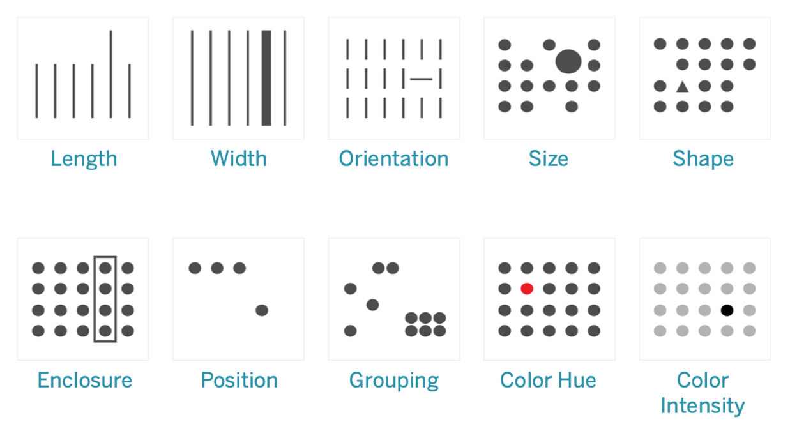

# The Science of Visual Perception

Understanding how humans process visual information is crucial for creating effective visualizations. Our brains process visual information in specific ways that we can leverage for better communication.

## Pre-attentive Processing

### Processing time
|Processing Type|Time|Characteristics|
|----------------|--------|-----------|
|Pre-attentive|<250ms|Fast, automatic, parallel; Detects visual properties, identifies patterns|
|Attentive|>250ms|Slow, effortful, serial; Focuses on details; interprets complex information|

Pre-attentive Processing:
- Fast, automatic, parallel
- Detects visual properties
- Identifies patterns

Attentive Processing:
- Slow, effortful, serial
- Focuses on details
- Interprets complex information

### Form Attributes - Visual Elements
1. Length:
- Bar charts
- Line length
- Progress bars
2. Size:
- Bubble plots
- Tree maps
- Icon size
3. Shape:
- Markers
- Icons
- Symbols
3. Enclosure:
- Boundaries
- Containers
- Groups

### Color Attributes - Properties
1. Hue:
- Categories
- Distinct groups
- Qualitative data
2. Intensity:
- Sequential data
- Heat maps
- Density plots
3. Position:
- Coordinates
- Placement
- Alignment

## Gestalt Principles

#### Key Principles:
1. Simplicity
- Maximize impact, minimize noise
- If it doesn't add value or serve a purpose, get rid of it
2. Narrative
- Don't just show it; tell a story with your data
- Communicate key insights clearly, quickly and powerfully
3. Balance between design & function
- Selecting the right chart type, color scheme, and layout
- Beautiful is good, functional is better, both is best

> "The goal of a visualization is insight, not pictures." - Ben Shneiderman

**The 10-Second Rule**
- If your audience can't understand your visualization in 10 seconds, it's not effective
- Keep it simple, clear, and focused on the key message