# Introduction

Seaborn is your statistical visualization powerhouse - think of it as Matplotlib with a PhD in Statistics. It's designed to make complex statistical visualizations both beautiful and informative, while requiring minimal code.

|Feature|Benefit|
|-------|-------|
|Beautiful Defaults|Professional-looking visualizations out-of-the-box|
|Statistical Power|Built-in statistical computations (regression, distributions, etc.)|
|Pandas Integration|Seamless handling of DataFrames and Series objects|
|Declarative API|Objects interface for modular, grammar-based plots (as of v0.12+)|
|Figure-level Functions|Comprehensive visualizations with minimal code|

## Getting Started

[https://colab.research.google.com/drive/1rRY5H4ZbTiD2DZ7npF5ZUOanEFvb4hcM?usp=sharing](https://colab.research.google.com/drive/1rRY5H4ZbTiD2DZ7npF5ZUOanEFvb4hcM?usp=sharing)

Let's start with the basic setup and learn how to create our first Seaborn visualizations.

### Setting Up Your Environment
```py
# Import the libraries we'll need
import seaborn as sns        # For statistical visualizations
import matplotlib.pyplot as plt    # For customizing plots
import pandas as pd          # For data handling
import numpy as np           # For numerical operations

# Set up Seaborn with nice default settings
# This makes ALL your plots look better automatically!
def setup_seaborn_defaults():
    """
    Set up Seaborn with clean, professional defaults.
    Run this once at the beginning of your notebook.
    """
    # Set the theme - 'whitegrid' gives a clean, professional look
    sns.set_theme(
        style="whitegrid",     # Clean background with helpful grid
        palette="deep",        # Professional color palette
        font="sans-serif",     # Modern, readable font
        font_scale=1.1         # Slightly larger text for readability
    )
    
    # Make figures a good default size
    plt.rcParams.update({
        'figure.figsize': (10, 6),  # Width, height in inches
        'figure.dpi': 100,          # Resolution
    })
    
    print("✓ Seaborn is set up and ready to make beautiful plots!")

# Run the setup function
setup_seaborn_defaults()
```

### Data Loading & Inspection
Seaborn comes with several built-in datasets that are perfect for learning:
```py
# Let's look at what datasets are available in Seaborn
print("Available datasets in Seaborn:")
print(sns.get_dataset_names())

# Load the 'tips' dataset - a classic for learning Seaborn
# This dataset contains information about restaurant bills and tips
tips = sns.load_dataset("tips")

# Let's see what's in this dataset
print("\nFirst few rows of the tips dataset:")
print(tips.head())  # Show the first 5 rows

# Get a summary of the dataset
print("\nDataset information:")
print(f"Number of records: {len(tips)}")
print(f"Columns: {', '.join(tips.columns.tolist())}")

# Quick statistics about the numerical columns
print("\nQuick statistics:")
print(tips.describe())
```

### Your First Seaborn Plot
Let's create our first simple visualization:
```py
# Create a simple scatter plot showing the relationship
# between the total bill and the tip amount
plt.figure(figsize=(10, 6))  # Set the figure size

# This single line creates a scatter plot with a trend line!
sns.regplot(
    data=tips,           # Our dataset
    x="total_bill",      # For the x-axis, use the bill amount
    y="tip",             # For the y-axis, use the tip amount
    scatter_kws={"alpha": 0.5},  # Make points semi-transparent
    line_kws={"color": "red"}    # Make the trend line red
)

# Add labels and title
plt.title("Relationship Between Bill Size and Tip Amount", fontsize=16)
plt.xlabel("Total Bill Amount in Dollars", fontsize=12)
plt.ylabel("Tip Amount in Dollars", fontsize=12)

# Show the plot
plt.tight_layout()  # Adjusts the plot to make sure everything fits
plt.show()

print("Notice how Seaborn automatically added the trend line and shaded confidence interval!")
print("This shows that larger bills tend to get larger tips (not surprising!).")
```
**Output**
```py
> Available datasets in Seaborn:
['anagrams', 'anscombe', 'attention', 'brain_networks', 'car_crashes', 'diamonds', 'dots', 'dowjones', 'exercise', 'flights', 'fmri', 'geyser', 'glue', 'healthexp', 'iris', 'mpg', 'penguins', 'planets', 'seaice', 'taxis', 'tips', 'titanic']

First few rows of the tips dataset:
   total_bill   tip     sex smoker  day    time  size
0       16.99  1.01  Female     No  Sun  Dinner     2
1       10.34  1.66    Male     No  Sun  Dinner     3
2       21.01  3.50    Male     No  Sun  Dinner     3
3       23.68  3.31    Male     No  Sun  Dinner     2
4       24.59  3.61  Female     No  Sun  Dinner     4

Dataset information:
Number of records: 244
Columns: total_bill, tip, sex, smoker, day, time, size

Quick statistics:
                    total_bill         		tip        							size
count  	244.000000  	244.000000  244.000000
mean    19.785943    			2.998279    			2.569672
std      	8.902412    				1.383638    			0.951100
min      	3.070000    			1.000000    		1.000000
25%     	13.347500    			2.000000    		2.000000
50%     	17.795000    			2.900000    		2.000000
75%     	24.127500    			3.562500    			3.000000
max     	50.810000   			10.000000    	6.000000
```
## Distribution Analysis: Understanding your data
Visualizing distributions helps you understand what values are common or rare in your data.
### Histograms and KDE Plots
```py
# Let's look at the distribution of bill amounts
plt.figure(figsize=(12, 6))

# Create a histogram with a smooth density curve (KDE)
sns.histplot(
    data=tips,           # Our dataset
    x="total_bill",      # The column we want to visualize
    kde=True,            # Add a smooth density curve
    color="skyblue",     # Set the bar color
    line_kws={"color": "darkblue", "linewidth": 2}  # Style for the KDE line
)

# Add labels and title
plt.title("Distribution of Bill Amounts", fontsize=16)
plt.xlabel("Total Bill Amount in Dollars", fontsize=12)
plt.ylabel("Count", fontsize=12)

# Add a note about the average
avg_bill = tips["total_bill"].mean()
plt.axvline(avg_bill, color='red', linestyle='--', 
            label=f"Average: ${avg_bill:.2f}")
plt.legend()

plt.tight_layout()
plt.show()
```
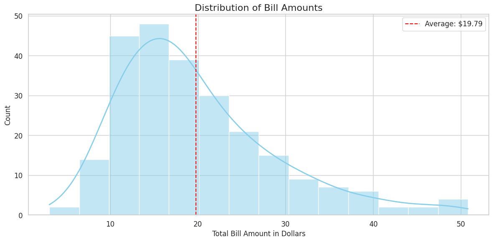

This histogram shows how bill amounts are distributed:
- Most bills are between $10 and $20
- Very few bills exceed $40
- The distribution has a 'right skew' (tail extends to the right)

### Comparing Distributions with Box Plots
Box plots help compare distributions across categories:
```py
# Compare bill amounts across different days of the week
plt.figure(figsize=(12, 6))

# Create a box plot
sns.boxplot(
    data=tips,        # Our dataset
    hue="day",          # Categories for comparison
    y="total_bill",   # Values to compare
    palette="pastel",  # Color scheme
    legend=False
)

# Add labels and title
plt.title("Bill Amounts by Day of Week", fontsize=16)
plt.xlabel("Day of Week", fontsize=12)
plt.ylabel("Total Bill Amount in Dollars", fontsize=12)

# Add some explanation text on the plot
plt.text(0.5, 45, "Box Plot Shows:", fontsize=12)
plt.text(0.5, 40, "- Box: 25th to 75th percentile", fontsize=10)
plt.text(0.5, 37, "- Line: median (middle value)", fontsize=10)
plt.text(0.5, 34, "- Whiskers: range of typical values", fontsize=10)
plt.text(0.5, 31, "- Points: outliers", fontsize=10)

plt.tight_layout()
plt.show()
```
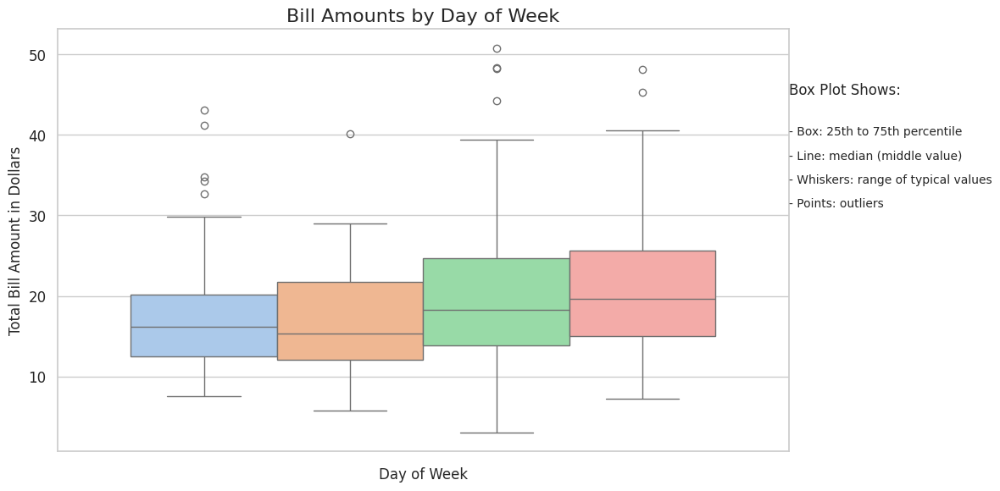

From this box plot, we can see:
- Weekend bills (Sat/Sun) tend to be higher than weekday bills
- Sunday has the widest range of bill amounts
- Thursday has the lowest median bill amount

<hr/>

## Categorical Visualizations: Comparing Groups
Categorical plots help you compare measurements across different groups or categories.

### Bar Charts with Error Bars
```py
# Let's compare average tips by day and whether it was dinner or lunch
plt.figure(figsize=(12, 6))

# Create a bar plot with confidence intervals
sns.barplot(
    data=tips,              # Our dataset
    x="day",                # Categories on x-axis
    y="tip",                # Values to compare
    hue="time",             # Split each day by time (lunch vs dinner)
    palette=["lightblue", "coral"],  # Custom colors
    errorbar=("ci", 95),     # Add 95% confidence intervals
    capsize=0.1             # Cap size for error bars
)

# Add labels and title
plt.title("Average Tip by Day and Time", fontsize=16)
plt.xlabel("Day of Week", fontsize=12)
plt.ylabel("Average Tip Amount in Dollars", fontsize=12)

# Improve the legend
plt.legend(title="Meal Time")

plt.tight_layout()
plt.show()
```
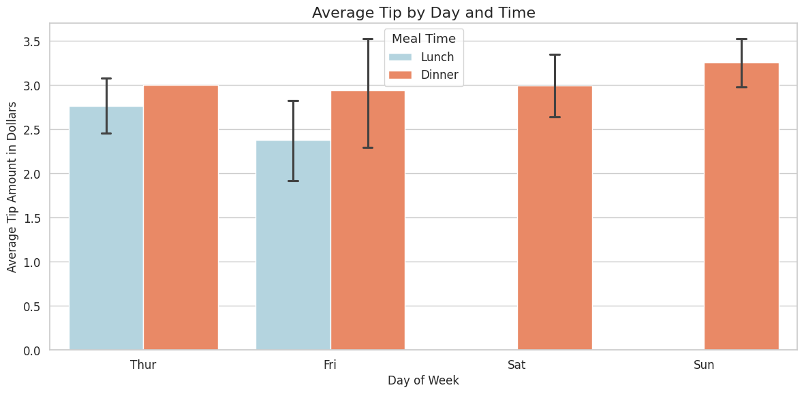

This bar chart shows the average tip amount for each day and meal time:
- Error bars show 95% confidence intervals (statistical uncertainty)
- Dinner tips are generally higher than lunch tips
- Sunday has the highest average tips

### Count Plots for Frequencies
```py
# Let's look at how many customers we have in each day/time combination
plt.figure(figsize=(12, 6))

# Create a count plot
sns.countplot(
    data=tips,
    x="day",
    hue="time",
    palette=["lightgreen", "darkgreen"]
)

# Add labels and title
plt.title("Number of Customers by Day and Time", fontsize=16)
plt.xlabel("Day of Week", fontsize=12)
plt.ylabel("Number of Customers", fontsize=12)

# Improve the legend
plt.legend(title="Meal Time")

# Add count labels on top of each bar
for p in plt.gca().patches:
    plt.gca().annotate(f"{p.get_height()}", 
                       (p.get_x() + p.get_width() / 2., p.get_height()),
                       ha = 'center', va = 'bottom', fontsize=10)

plt.tight_layout()
plt.show()
```

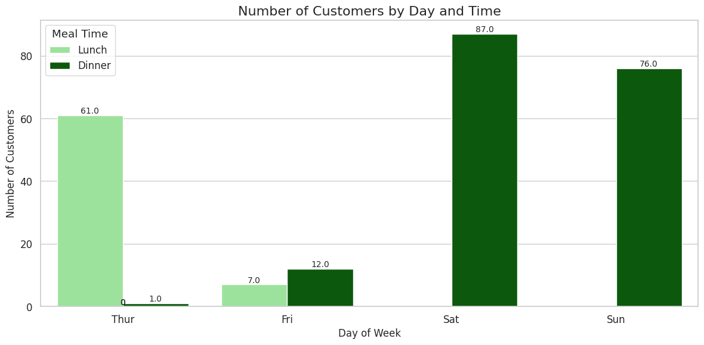
This count plot shows how busy the restaurant is:
- Saturday dinner is the busiest time
- The restaurant doesn't serve weekday dinners (except Thursday)
- Sunday is exclusively a dinner service
<hr/>

## Relationship Visualizations: Finding Connections
These plots help you discover how different variables relate to each other.

### Scatter Plots with Categories
```py
# Let's look at the relationship between bill size and tip,
# but separate by gender and meal time
plt.figure(figsize=(14, 7))

# Create a scatter plot with colored categories
sns.scatterplot(
    data=tips,
    x="total_bill",        # X-axis: bill amount
    y="tip",               # Y-axis: tip amount
    hue="sex",             # Color points by gender
    style="time",          # Use different markers for lunch vs dinner
    size="size",           # Size points by party size
    sizes=(20, 200),       # Range of point sizes (min, max)
    alpha=0.7              # Make points slightly transparent
)

# Add labels and title
plt.title("Relationship Between Bill Amount and Tip by Gender and Time", fontsize=16)
plt.xlabel("Total Bill Amount in Dollars", fontsize=12)
plt.ylabel("Tip Amount in Dollars", fontsize=12)

# Improve the legend
plt.legend(title="Customer Information", fontsize=10, title_fontsize=12)

plt.tight_layout()
plt.show()
```

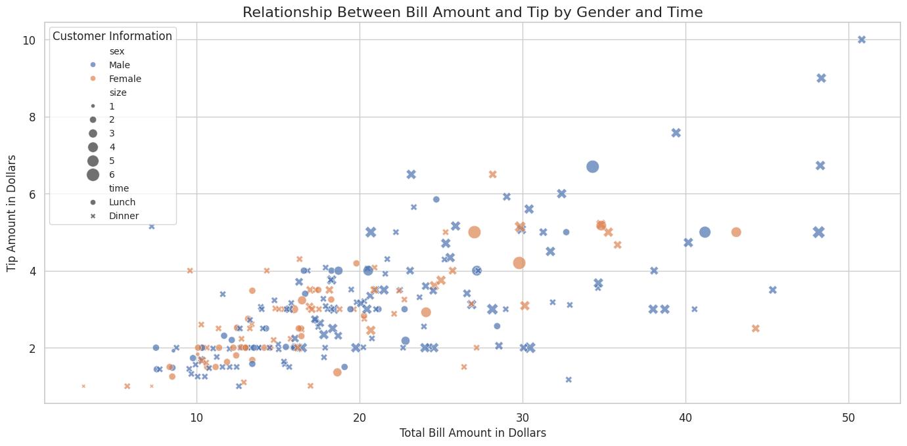

This scatter plot reveals several patterns:
- Larger bills generally get larger tips (positive correlation)
- Male customers seem to have more of the large bills
- Dinner bills tend to be larger than lunch bills
- Larger party sizes (bigger points) generally have larger bills

### Pair Plots for Multiple Relationships
```py
# Create a pair plot to see relationships between multiple variables
pair_plot = sns.pairplot(
    data=tips,
    vars=["total_bill", "tip", "size"],  # Variables to include
    hue="time",                          				# Color by meal time
    palette="Set2",                      			# Color palette
    height=2.5,                          				# Size of each subplot
    diag_kind="kde",                     		# Show KDE on diagonal
    corner=True                          			# Only show lower triangle
)

# Add a title
pair_plot.fig.suptitle("Relationships Between Bill, Tip, and Party Size", 
                      fontsize=16, y=1.02)

plt.tight_layout()
plt.show()
```
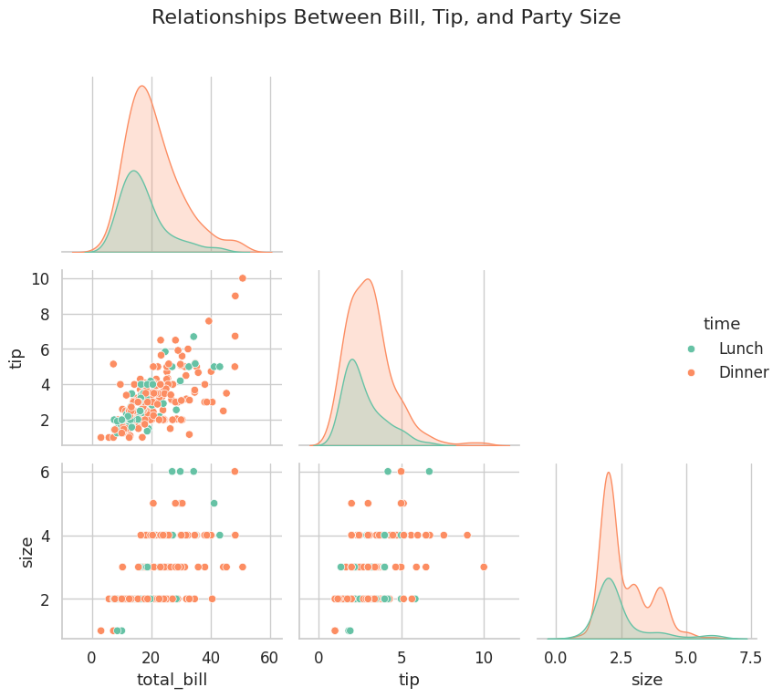

This pair plot shows all relationships between numerical variables at once:
- Each dot represents one customer
- Diagonal: Distribution of each variable
- Off-diagonal: Relationship between variables
- Color: Lunch (blue) vs Dinner (orange)
- Notice that all variables show positive relationships with each other

<hr/>

## Complete Example: Let's Analyze the Titanic Dataset
Let's put everything together and analyze a real-world dataset: the Titanic passenger data.

```py
# Load the Titanic dataset
titanic = sns.load_dataset("titanic")

# Let's look at the first few rows
print("First few rows of Titanic dataset:")
print(titanic.head())

print("\nBasic information about the dataset:")
print(f"Number of passengers: {len(titanic)}")
print(f"Columns: {', '.join(titanic.columns.tolist())}")
print(f"Survival rate: {titanic['survived'].mean():.1%}")

# DATA CLEANING
# Fill missing ages with median
titanic["age"] = titanic["age"].fillna(titanic["age"].median())

# Create age groups for easier analysis
titanic["age_group"] = pd.cut(
    titanic["age"],
    bins=[0, 12, 18, 35, 60, 100],
    labels=["Child", "Teen", "Young Adult", "Adult", "Senior"]
)

print("\nAge groups created:", titanic["age_group"].value_counts().to_dict())
```

```py
First few rows of Titanic dataset:
   		survived  pclass     		sex   	age  sibsp  parch     				fare embarked  		class  
0         			0       		3    		male  22.0      		1      		0   	7.2500        					S  		Third   
1         				1       			1  	female  38.0      		1	      	0  	71.2833        					C  			First   
2         				1	       		3  	female  26.0      		0      		0   	7.9250        					S  		Third   
3         				1       			1  	female  35.0      		1      		0  	53.1000        					S  			First   
4         			0       		3    		male  35.0      		0      		0   	8.0500        					S  		Third   

     				who  adult_male 		deck  	embark_town 		alive  alone  
0   	 		man        			True  	NaN  	Southampton    		no  False  
1  	woman       			False    				C    			Cherbourg   	yes  False  
2  	woman       			False  		NaN  Southampton   		yes   True  
3  	woman       			False    				C  Southampton   		yes  False  
4    			man        		True  		NaN  Southampton    			no   True  

Basic information about the dataset:
Number of passengers: 891
Columns: survived, pclass, sex, age, sibsp, parch, fare, embarked, class, who, adult_male, deck, embark_town, alive, alone
Survival rate: 38.4%

Age groups created: {
		'Young Adult': 535, 
		'Adult': 195, 
		'Teen': 70, 
		'Child': 69, 
		'Senior': 22
	}
```

### Survival Overview

```py
plt.figure(figsize=(12, 5))

# Create two subplots side by side
plt.subplot(1, 2, 1)
# Fixed line - using hue parameter and legend=False
sns.countplot(x="survived", hue="survived", data=titanic, palette=["#FF5A5F", "#00A699"], legend=False)
plt.title("Passenger Survival Count", fontsize=14)
plt.xlabel("Survived", fontsize=12)
plt.ylabel("Number of Passengers", fontsize=12)
plt.xticks([0, 1], ["No", "Yes"])

# Add count annotations
for p in plt.gca().patches:
    plt.gca().annotate(f"{p.get_height()}", 
                      (p.get_x() + p.get_width() / 2., p.get_height() + 10),
                      ha = 'center', fontsize=11)

plt.subplot(1, 2, 2)
survival_rate = titanic["survived"].mean()
plt.pie([1-survival_rate, survival_rate], 
        labels=["Died", "Survived"], 
        autopct='%1.1f%%',
        colors=["#FF5A5F", "#00A699"],
        explode=[0, 0.1],
        startangle=90)
plt.title("Survival Rate", fontsize=14)

plt.tight_layout()
plt.show()
```

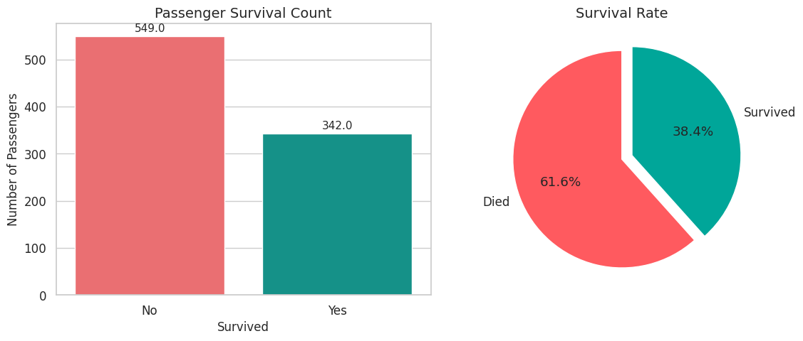
The Titanic disaster had a survival rate of only about 38%.
Of the 891 passengers in our dataset, more than 500 did not survive.

### Survival by class and sex
```py
plt.figure(figsize=(14, 6))

# Create subplots
plt.subplot(1, 2, 1)
sns.barplot(
    data=titanic, 
    x="pclass", 
    y="survived",
    hue="pclass",  # Added hue parameter
    palette=["#3E4A89", "#6CAE75", "#D4A6C8"],
    errorbar=None,
    legend=False  # Added legend=False
)
plt.title("Survival Rate by Passenger Class", fontsize=14)
plt.xlabel("Passenger Class", fontsize=12)
plt.ylabel("Survival Rate", fontsize=12)
plt.ylim(0, 1)

# Add percentage labels on bars
for i, rate in enumerate(titanic.groupby("pclass")["survived"].mean()):
    plt.text(i, rate + 0.02, f"{rate:.1%}", ha="center", fontsize=11)

# Add explanation
plt.text(0.5, 0.8, "1st Class: Upper Deck", fontsize=9)
plt.text(1.5, 0.55, "2nd Class: Middle Deck", fontsize=9)
plt.text(2.5, 0.25, "3rd Class: Lower Deck", fontsize=9)

plt.subplot(1, 2, 2)
sns.barplot(
    data=titanic, 
    x="sex", 
    y="survived",
    hue="sex",  # Added hue parameter
    palette=["#FF9EAA", "#91CDF2"],
    errorbar=None,
    legend=False  # Added legend=False
)
plt.title("Survival Rate by Gender", fontsize=14)
plt.xlabel("Gender", fontsize=12)
plt.ylabel("Survival Rate", fontsize=12)
plt.ylim(0, 1)

# Add percentage labels on bars
for i, rate in enumerate(titanic.groupby("sex")["survived"].mean()):
    plt.text(i, rate + 0.02, f"{rate:.1%}", ha="center", fontsize=11)

plt.tight_layout()
plt.show()
```

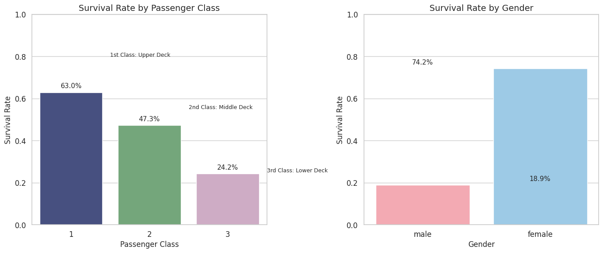

### Survival by age

```py
plt.figure(figsize=(14, 6))

# Create a violin plot to show distribution of ages by survival
plt.subplot(1, 2, 1)
sns.violinplot(
    data=titanic, 
    x="survived", 
    y="age",
    hue="survived",  # Added hue parameter
    palette=["#FF5A5F", "#00A699"],
    inner="quartile",
    legend=False  # Added legend=False
)
plt.title("Age Distribution by Survival", fontsize=14)
plt.xlabel("Survived", fontsize=12)
plt.ylabel("Age (Years)", fontsize=12)
plt.xticks([0, 1], ["No", "Yes"])

# Add horizontal lines for average ages
survived_mean = titanic[titanic["survived"] == 1]["age"].mean()
died_mean = titanic[titanic["survived"] == 0]["age"].mean()
plt.axhline(survived_mean, color="#00A699", linestyle="--", alpha=0.5)
plt.axhline(died_mean, color="#FF5A5F", linestyle="--", alpha=0.5)

plt.subplot(1, 2, 2)
sns.barplot(
    data=titanic, 
    x="age_group", 
    y="survived",
    hue="age_group",  # Added hue parameter
    palette="viridis",
    errorbar=None,
    legend=False  # Added legend=False
)
plt.title("Survival Rate by Age Group", fontsize=14)
plt.xlabel("Age Group", fontsize=12)
plt.ylabel("Survival Rate", fontsize=12)
plt.ylim(0, 1)

# Add percentage labels on bars
for i, rate in enumerate(titanic.groupby("age_group")["survived"].mean()):
    plt.text(i, rate + 0.02, f"{rate:.1%}", ha="center", fontsize=11)

plt.tight_layout()
plt.show()
```

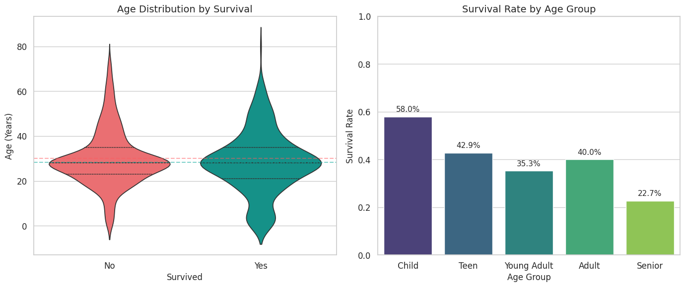
The age analysis reveals:
- Children had the highest survival rate (~59%)
- The average age of survivors was lower than non-survivors
- Seniors had the lowest survival rate (~24%)
- The violin plot shapes show that most passengers were young to middle-aged adults

### Class, gender and survival

```py
plt.figure(figsize=(14, 6))

# Create a grouped bar plot
sns.catplot(
    data=titanic,
    kind="bar",
    x="pclass",
    y="survived",
    hue="sex",
    palette=["#FF9EAA", "#91CDF2"],
    height=6,
    aspect=2,
    legend=False
)
plt.title("Survival Rate by Class and Gender", fontsize=16)
plt.xlabel("Passenger Class", fontsize=12)
plt.ylabel("Survival Rate", fontsize=12)
plt.ylim(0, 1)
plt.legend(title="Gender", loc="upper right")

# Add a text box with key findings
plt.text(
    0.02, 0.15, 
    "Key Findings:\n"
    "- 1st class women had nearly 100% survival\n"
    "- 1st class men survived more than 2nd or 3rd class women\n"
    "- 3rd class men had the lowest survival rate (~14%)",
    transform=plt.gca().transAxes,
    bbox=dict(facecolor='white', alpha=0.8, boxstyle='round,pad=0.5'),
    fontsize=11
)

plt.tight_layout()
plt.show()
```

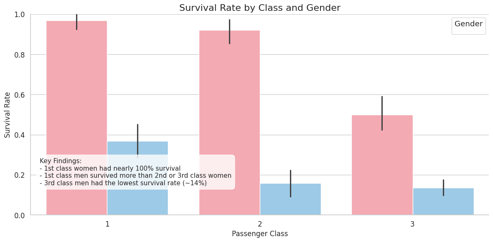

This visualization reveals the stark inequality in survival rates:
- Class and gender together strongly determined survival chances
- Being a woman increased survival chances in all classes
- Being in first class dramatically increased survival chances

### Correlation Heatmap

```py
plt.figure(figsize=(10, 8))

# Select only numeric columns
numeric_cols = ["survived", "pclass", "age", "sibsp", "parch", "fare"]
corr = titanic[numeric_cols].corr()

# Create a mask for the upper triangle (to avoid redundancy)
mask = np.triu(np.ones_like(corr, dtype=bool))

# Create the heatmap
sns.heatmap(
    corr, 
    mask=mask,
    annot=True,           # Show the correlation values
    fmt=".2f",            # Format as 2 decimal places
    cmap="coolwarm",      # Blue-red color scheme
    center=0,             # Center the color scale at 0
    square=True,          # Make cells square-shaped
    linewidths=0.5,       # Add thin lines between cells
    cbar_kws={"shrink": .8}  # Adjust colorbar size
)

plt.title("Correlation Between Variables", fontsize=16)
plt.tight_layout()
plt.show()
```

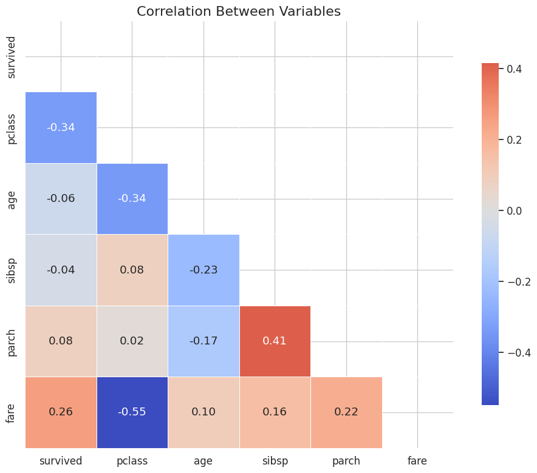

The correlation heatmap shows relationships between numeric variables:
- Negative correlation between pclass and survival (-0.34): lower class → lower survival
- Positive correlation between fare and survival (0.26): higher fare → higher survival
- Negative correlation between age and survival (-0.08): older passengers → slightly lower survival

## Best Practices for Beginners
1. **Start simple**: Begin with basic plots before moving to complex ones
2. **Label everything**: Always include clear titles, axis labels, and legends
3. **Choose appropriate colors**: Use color wisely to highlight important patterns
4. **Tell a story**: Organize your visualizations to reveal insights in a logical order
5. **Explain your findings**: Add text explanations to help others understand what they're seeing
6. **Save your work**: Use high-quality formats for presentations or reports
```py
# Save your plot in high-quality format
def save_visualization(fig, filename, dpi=300):
    """
    Save a visualization in high quality for reports or presentations
    
    Parameters:
    -----------
    fig : matplotlib figure
        The figure to save
    filename : str
        Name of the file (without extension)
    dpi : int
        Resolution (dots per inch) - higher means better quality
    """
    # Save in multiple formats
    fig.savefig(f"{filename}.png", dpi=dpi, bbox_inches="tight")
    print(f"✓ Plot saved as {filename}.png")
    
    # Optionally save in PDF for publications/presentations
    try:
        fig.savefig(f"{filename}.pdf", bbox_inches="tight")
        print(f"✓ Plot also saved as {filename}.pdf")
    except:
        print("Could not save PDF (may need additional libraries)")

# Example usage: 
# save_visualization(plt.gcf(), "titanic_survival_by_class")
```

## Additional Resources to Keep Learning
- Official Seaborn documentation: [https://seaborn.pydata.org/](https://seaborn.pydata.org/)
- Seaborn example gallery: [https://seaborn.pydata.org/examples/](https://seaborn.pydata.org/examples/)
- Built-in datasets to practice with: sns.get_dataset_names()
- Kaggle.com: Find interesting datasets to visualize